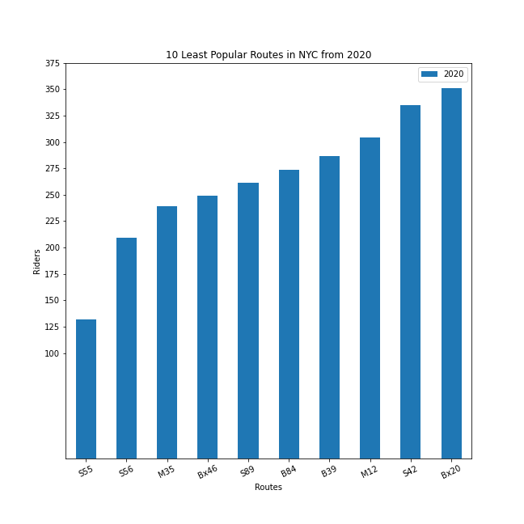

## The Pandemic That Caused a Decline in Ridership


Objective: The purpose of my project is to analyze MTA bus ridership data during 2020. The COVID-19 pandemic has significantly affected MTA and its commuters. In this project, I utilized the Pandas DataFrame to filter the data in my CSV file.

Background: It is important to solve this problem because many people who do not own cars rely on public transportation to take them to school and work. Unreliable service is unacceptable as people need to get to their destination on time whether it would be school or work. An existing solution is that bus routes are currently running at pre-pandemic headways. A drawback of the existing solution is that some bus routes do not have enough ridership and are mostly empty.

### Top 10 Routes From 2020

Below is the output from the CSV file that shows the top 10 most popular routes in New York City from 2020


The M15 Local/Select Bus Service was the most popular route during the pandemic with an average ridership of 25,399 riders. The Bx12 Local/Select Bus Service was the second most popular route in 2020 with an average ridership of 23,937 riders. The 3rd popular route was the B46 Local/Select Bus Service with 22,696 riders. The 4th most popular route was the B6 with 20,631 riders. The 5th most popular route was the B44 Local/Select Bus Service with 20,445 riders. The 6th most popular route was the B35 route with 17,811 riders. the 7th most popular route was the Q58 with 17,597 riders. The 8th most popular route was the B82 Local/Select Bus Service with 17,012 riders. The 9th most popular route was the Bx19 with 16,463 riders. Rounding out the top 10 most popular routes from 2020 was the Bx1/Bx2 with 16,429 riders. The Bx1 and Bx2 were counted together because they both travel along the same route between MOTT HAVEN 138 ST VIA CONCOURSE and RIVERDALE 231 ST via CONCOURSE. The only difference is that Bx1 is the Limited version of the Bx2 which means the Bx1 makes fewer stops.


Despite a decrease in ridership during the pandemic, these routes were still the 10 most popular routes during the Pandemic. The most popular route from Manhattan was the M15 Local/Select Bus Service. The most popular route from Queens was the Q58. The most popular route from Brooklyn was the B46 Local/Select Bus Service. Finally, the most popular route from the Bronx was the Bx12 Local/Select Bus Service.

### 10 Least Popular Routes From 2020

Below is the output from the CSV file that shows the 10 least popular routes in New York City from 2020


The S55 was the least popular route in NYC during the Pandemic. It was ranked 229 with an average of 132 riders. The S56 was the second least popular route in NYC with an average ridership of 209. The 3rd least popular route in 2020 was the M35 with an average of 239 riders. The 4th least popular route during the pandemic was the Bx46 route with an average ridership of 249 riders. The 5th least popular route was the S89 with an average ridership of 261 riders. The 6th least popular route of 2020 was the B84 with an average of 274 riders. The 7th least popular route of 2020 was the B39 with an average of 287 riders. The 8th least popular route during the pandemic was the M12 with an average of 304 riders. The 9th least popular route in NYC during 2020 was the S42 with an average of 335 riders. Finally, the 10th least popular route of 2020 was the Bx20 with 351 riders.



These routes had the least amount of ridership during the pandemic with the S55 having the lowest ridership out of all Local/Limited buses in NYC. Routes like the S55,S56,S42,S89, and Bx20 don't even have weekend service which also affects their ridership count. As shown in the graph, the ridership in these routes ranged from an average of 130 to 350 riders during the year.

```markdown
Syntax highlighted code block

# Header 1
## Header 2
### Header 3

- Bulleted
- List

1. Numbered
2. List

**Bold** and _Italic_ and `Code` text

[Link](url) and 
```

For more details see [Basic writing and formatting syntax](https://docs.github.com/en/github/writing-on-github/getting-started-with-writing-and-formatting-on-github/basic-writing-and-formatting-syntax).

### Jekyll Themes

Your Pages site will use the layout and styles from the Jekyll theme you have selected in your [repository settings](https://github.com/bl5903/MTAridership/settings/pages). The name of this theme is saved in the Jekyll `_config.yml` configuration file.

### Support or Contact

Having trouble with Pages? Check out our [documentation](https://docs.github.com/categories/github-pages-basics/) or [contact support](https://support.github.com/contact) and we’ll help you sort it out.
