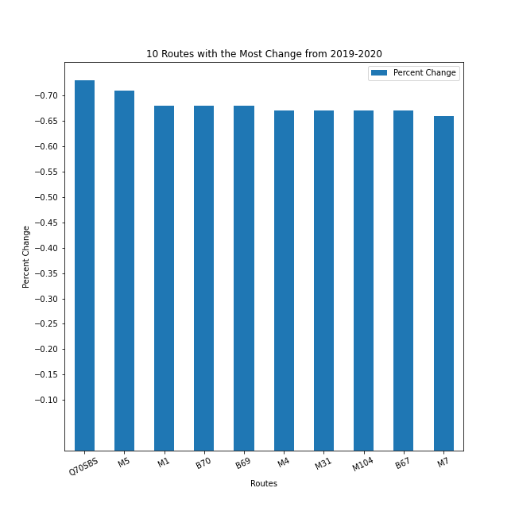
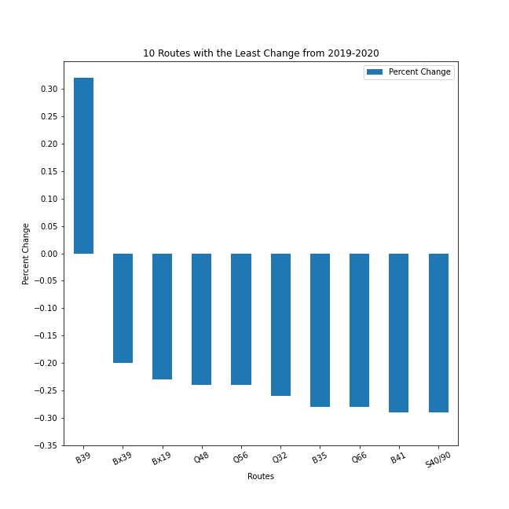

## The Pandemic That Caused a Decline in Ridership

Objective: The purpose of my project is to analyze MTA bus ridership data during 2020. The COVID-19 pandemic has significantly affected MTA and its commuters. In this project, I utilized the Pandas DataFrame to filter the data in my CSV file.

Background: It is important to solve this problem because many people who do not own cars rely on public transportation to take them to school and work. Unreliable service is unacceptable as people need to get to their destination on time whether it would be school or work. An existing solution is that bus routes are currently running at pre-pandemic headways. A drawback of the existing solution is that some bus routes do not have enough ridership and are mostly empty.

### Top 10 Routes From 2020

Below is the output from the CSV file that shows the top 10 most popular routes in New York City from 2020

The M15 Local/Select Bus Service was the most popular route during the pandemic with an average ridership of 25,399 riders. The Bx12 Local/Select Bus Service was the second most popular route in 2020 with an average ridership of 23,937 riders. The 3rd popular route was the B46 Local/Select Bus Service with 22,696 riders. The 4th most popular route was the B6 with 20,631 riders. The 5th most popular route was the B44 Local/Select Bus Service with 20,445 riders. The 6th most popular route was the B35 route with 17,811 riders. the 7th most popular route was the Q58 with 17,597 riders. The 8th most popular route was the B82 Local/Select Bus Service with 17,012 riders. The 9th most popular route was the Bx19 with 16,463 riders. Rounding out the top 10 most popular routes from 2020 was the Bx1/Bx2 with 16,429 riders. The Bx1 and Bx2 were counted together because they both travel along the same route between MOTT HAVEN 138 ST VIA CONCOURSE and RIVERDALE 231 ST via CONCOURSE. The only difference is that Bx1 is the Limited version of the Bx2 which means the Bx1 makes fewer stops.

Despite a decrease in ridership during the pandemic, these routes were still the 10 most popular routes during the Pandemic. The most popular route from Manhattan was the M15 Local/Select Bus Service. The most popular route from Queens was the Q58. The most popular route from Brooklyn was the B46 Local/Select Bus Service. Finally, the most popular route from the Bronx was the Bx12 Local/Select Bus Service.

### 10 Least Popular Routes From 2020

Below is the output from the CSV file that shows the 10 least popular routes in New York City from 2020

The S55 was the least popular route in NYC during the Pandemic. It was ranked 229 with an average of 132 riders. The S56 was the second least popular route in NYC with an average ridership of 209. The 3rd least popular route in 2020 was the M35 with an average of 239 riders. The 4th least popular route during the pandemic was the Bx46 route with an average ridership of 249 riders. The 5th least popular route was the S89 with an average ridership of 261 riders. The 6th least popular route of 2020 was the B84 with an average of 274 riders. The 7th least popular route of 2020 was the B39 with an average of 287 riders. The 8th least popular route during the pandemic was the M12 with an average of 304 riders. The 9th least popular route in NYC during 2020 was the S42 with an average of 335 riders. Finally, the 10th least popular route of 2020 was the Bx20 with 351 riders.

These routes had the least amount of ridership during the pandemic with the S55 having the lowest ridership out of all Local/Limited buses in NYC. Routes like the S55,S56,S42,S89, and Bx20 don't even have weekend service which also affects their ridership count. As shown in the graph, the ridership in these routes ranged from an average of 130 to 350 riders during the year.

### 10 Routes From 2020 that had the most change in ridership from 2019

Below is the output from the CSV file that shows the 10 routes in New York City that had the most change in ridership from 2019

The Q70SBS had the most change in ridership from 2019-2020. The route lost 73 percent of its riders during the pandemic. The 2nd route that showed the most change in ridership from 2019 was the M5 which lost 71 percent of its ridership. The M1, B70, and B69 all lost 68 percent of its ridership while the M4, M31, M104, B67 all lost 67 percent of its ridership. The 10th route to show the most change in its ridership was the M7 which lost 66 percent of its ridership.

The Q70 Select Bus Service (also known as LaGuardia Link) lost the most change in its ridership out of all routes in NYC. The Q70SBS runs from Woodside 61st to LaGuardia Airport. Its main purpose is to connect people from the subway to the airport. The Q70SBS lost most of its riders because most people were not travelling to and from the airport. Since most people were not travelling domestically or internationally, the Q70SBS had the most change during the pandemic (73% lost). The M5 was the only other route that lost 70 percent of its ridership due to the pandemic. The M1, B70, and B69 all lost 68 Percent of its ridership. The M4, M31, M104, B67 all lost 67 percent of its ridership. Rounding out the routes that had the most change in its ridership was the M7 with a loss of 66 percent.

### 10 Routes From 2020 that had the least change in ridership from 2019

Below is the output from the CSV file that shows the 10 routes in New York City that had the most change in ridership from 2019

These routes had the least change in ridership from 2019 during the pandemic. The B39 actually had an increase in ridership during the pandemic. The B39 gained 32 percent in ridership. The 2nd route with the least change during the pandemic was the Bx39 with a loss in 20 percent of its ridership. The 3rd route with the least change in ridership was the Bx19 with a loss of 23 percent of its ridership. Both the Q48 and Q56 had a loss of 24 percent in its ridership. The Q32 only lost 26 percent of its ridership during 2020. The B35 and Q66 both lost 28 percent of its ridership during the pandemic. Rounding out the 10 routes that had the least change in ridership from 2019 during the pandemic was the B41 and S40/S90 which lost 29 percent of its ridership.

The B39 was the only route in New York City that had an increase in ridership during the pandemic. These routes showed the least change in ridership because most of the routes traveled along subway routes. For example, the Q32, Q48, and Q66 all travel along the 7 line in Queens. The Bx19 and Bx39 routes travel along the 2 and 5 lines in the Bronx. The Q56 travels along the J line in Queens. The B39 travels along the J and M lines from Williamsburg Bridge Plaza to the Lower East side of Manhattan via the Williamsburg Bridge. Meanwhile, the B35 and B41 travel through various subway lines in Brooklyn.

### Analysis/Thoughts
The COVID-19 Pandemic has severely affected the ridership in NYC. Most commuters were either essential workers or commuters that were going out for grocery shopping. During the start of the Pandemic, the MTA decided that all Local/Limited bus rides would be for free. Customers boarded through the back door rather than going through the front door. Customers still had to pay the regular fare to use the subway. As a result, bus routes that ran along subway routes had a better ridership than those that didn't. The B39 was the only bus route in NYC that saw an increase in ridership. The least popular route in NYC was the S55. The least popular routes had an average ridership of 130 riders to 350 riders. The most popular route in NYC was the M15 Local/ Select Bus Service. The most popular routes had an average ridership of 16,500 to 25,500 riders.

 

### Project Link

Link used to get ridership data. [Ridership Data](https://new.mta.info/agency/new-york-city-transit/subway-bus-ridership-2020)
